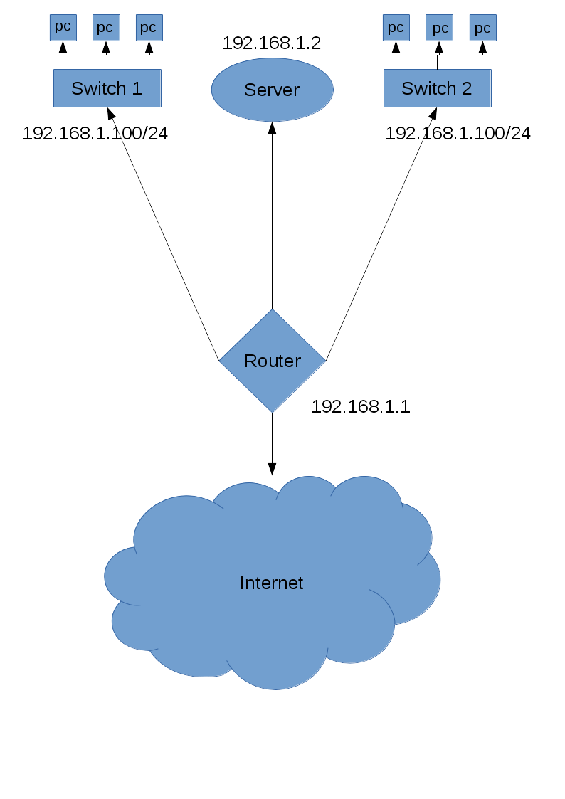
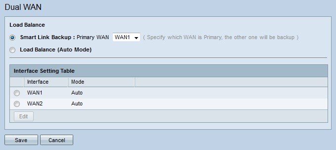
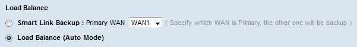

# ARX
Fait par Axel Lheureux et Théo Plockyn

- - - 

Introduction - Budgetisation
=============

### Equipements 
Les noms d'équipements sont cliquables.  

- Switch [**TP-Link TL-SG1024D**](https://www.amazon.fr/TP-Link-TL-SG1024D-Gigabit-Rackable-Bo%C3%AEtier/dp/B003UWXFM0/ref=sr_1_1?ie=UTF8&qid=1476177479&sr=8-1) 96.99€ * 2  
- Routeur [**Cisco rv320**](http://www.ldlc-pro.com/fiche/PB00149718.html) 158.29€ 

### Abonnement internet
- Orange fibre intense 65€ HT/mois * 2

### Total
482.27€

\newpage

## Load Balance

Le routeur Cisco rv320 possède deux ports WAN et fait le load-balancing automatiquement, il suffit d'activer l'option dans l'interface d'administration

1. Cliquer sur le bouton radio correspondant au load-balancing.  

2. Cliquer sur "Save". Le load-balancing est activé.

- - - 

## Configuration DHCP & DNS:

        client-router#configure terminal  
        client-router(config)#ip dhcp pool CLIENT_LAN  
        client-router(dhcp-config)#network 192.168.1.0 255.255.255.0  
        client-router(dhcp-config)#default-router 192.168.1.1  
        client-router(dhcp-config)#ip dns-server  
        client-router(dhcp-config)#ip domain-lookup  
        client-router(dhcp-config)#ip host www.localsite.com 192.168.1.2  
        client-router(dhcp-config)#ip name-server 8.8.8.8  

Pour les connexions extérieures, cela est géré lorsqu'on réserve le nom de domaine. ( Pour une configuration où on possède un seul fournisseur. Pour deux fournisseurs, nous n'avons pas trouvé la solution pour le moment )

\newpage
## Sources:
[**Lien vers IT-Connect pour DHCP/DNS**](http://www.it-connect.fr/configurer-le-service-dhcp-sur-un-routeur-cisco/)
[**Lien vers un tutoriel cisco pour le dual WAN**](http://sbkb.cisco.com/CiscoSB/GetArticle.aspx?docid=d6c17b6ee53141f59ae03c6defeb20cb_Dual_WAN_Configuration_on_RV320_Router.xml&pid=2&converted=0)
[**Lien vers la documentation cisco du routeur**](http://www.cisco.com/c/dam/en/us/td/docs/routers/csbr/rv320/administration/guide/en/rv32x_ag_en.pdf)

